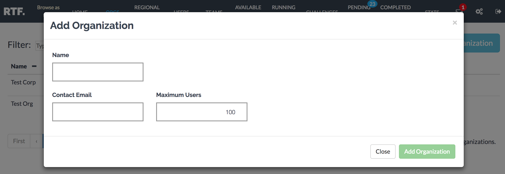
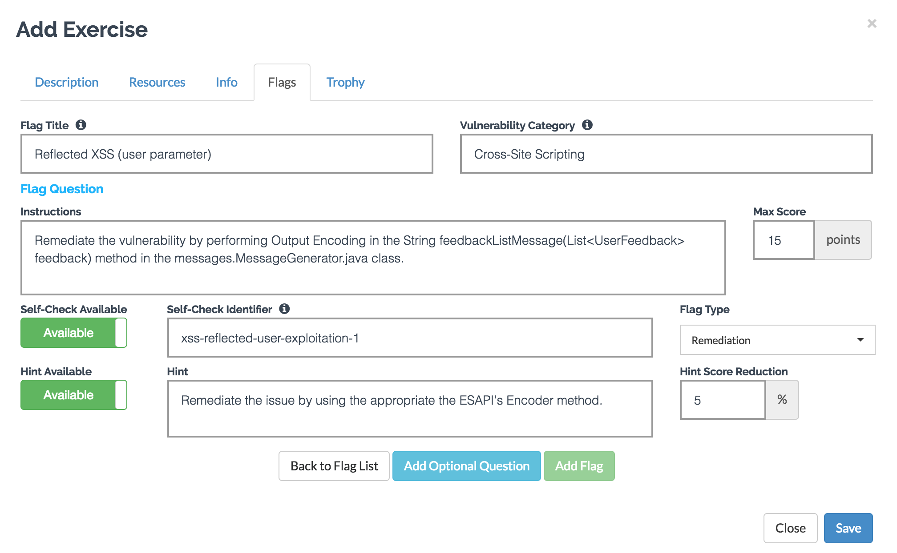
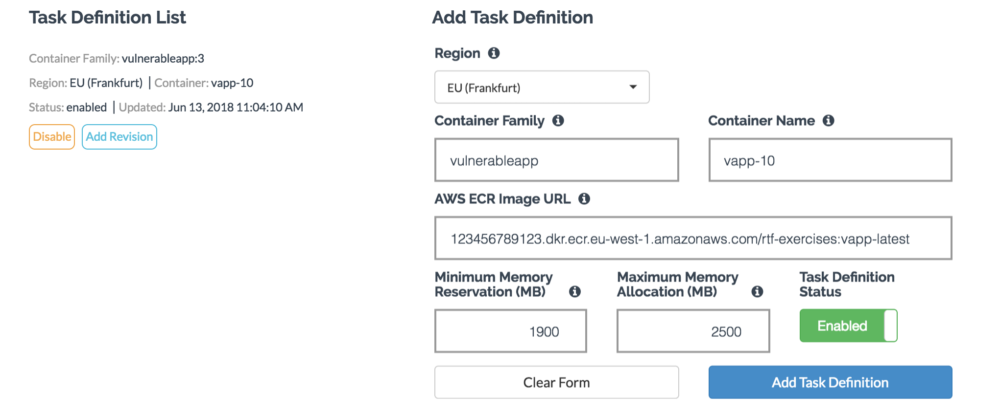

### Platform Configuration ###

The platform comes installed with an admin user (its password is set on the RTF Master Template in CloudFormation), a sample organization and a team. Setup the platform by creating organizations, teams and users to mirror your internal structure. It is also possible to invite users to signup to a specific organization by generating invitation codes that users can redeem. 

1. **Create Organizations**

    Organizations model a company or a division within a company. Users can be part of one organisation, management users can manage multiple organisations.

    

    

    Through the management interface, admins can generate codes to invite users to join the platform.

    

    

2. **Create Users**

   Add users to a specific Organization, specify user role and how many exercises the user can run concurrently.
   

   Available Roles:

   - Admin:
      Full administrative read/write access

   - User
      Run exercises, join Challenges, view completed exercises, personal/team stats and achievements.

      

3. **Create Teams**

    Through the management interface create Teams and Users to them. Teams as Users belong to one organizations. Currently a User can be added to only one Team. Team Managers can review exercises completed by members of their teams. Team Managers can also add/remove users to their Teams.

       

    

4. **Onboard Regional Gateways**

    The RTF Gateway mediates the access to an RTF Exercise running in an ECS cluster. Onboard the RTF Gateway created during deployment and any additional regional gateways you deployed using the Regional Gateway [template](https://s3-eu-west-1.amazonaws.com/rtf-public-templates/rtf-template-regional-gateway.yaml). To onboard the Gateway just specify a name, the AWS Region where the Gateway and ECS Cluster are deployed and the FQDN for the regional gateways. Users will connect to the regional gateway while performing the exercise. To keep latency down it is advised to deploy regional clusters/gateways in regions geographically close to the platform users.

    

5. **Add Exercises**

    Add the *metadata* for the exercise including title, description, category, score, trophy, etc. Provide a reference file for the exercise describing further instructions for the candidates and a solutions file. The exercise data can also be imported/exported for easier onboarding.

    

    

    Add 'Flags' in scope for the exercise. Each Flag (e.g. Reflected XSS - User Parameter) has an exploitation and a remediation part. Provide the instructions on how to exploit and how to remediate the Flag. You can also provide a hint (visible to reviewer, affects final score) and the name of the test performed by the automated checker (see later in the documentation).

    

    

6. **Enable Exercises for Organizations**

    Once added, an exercise needs to be enabled for each organization. Admin users can enable/disable exercises for managed organizations.

    

    

7. **Register Exercises on Regional Clusters**

    To run an exercise, you need to have the corresponding RTF Exercise docker image on your AWS ECR repository. You need to register the exercise on each regional cluster where you want to make it available. Behind the scenes, the RTF Platform creates a TaskDefinition  to run the exercise's image in the specified AWS Region. Data transferred between Amazon Elastic Container Registry (ECR) and Amazon EC2 within a single region is free of charge, so to lower costs keep an image of the exercise in an ECR repository of each region where you deployed an RTF Gateway.

    

    
